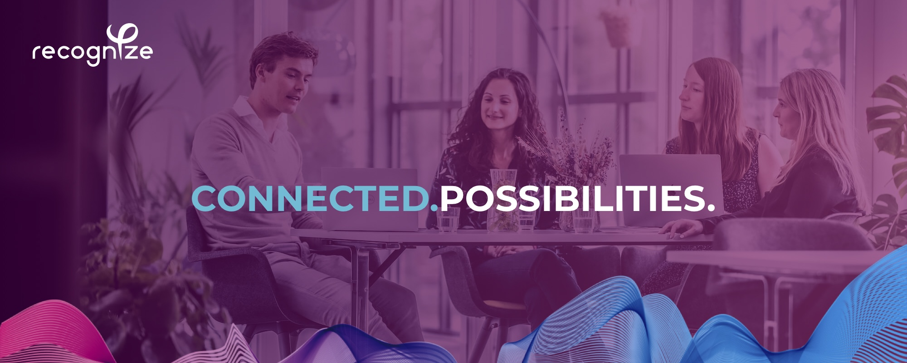

Helping organizations devise, design and develop digital solutions. That’s what Recognize does. Day in, day out, we connect business with IT. In other words: connected possibilities.

No matter how difficult something seems, we make it clear. For ourselves, our customers and the users. This results in the latest developments, smooth processes and better applications. In addition, we find it important that we continue to grow both professionally and personally. Because only then can we continue to realize the digital expertise we stand for.

### This is what we stand for
People, craftsmanship and progress. We believe that no one is the same, but that everyone is equal. When people are happy and happy with what they do, they go a lot further.

- **Transparency**
  Sincere cooperation can only exist if we are transparent with each other and to our customers. We provide a clear insight into the sprint's progress, budget, and scope. We make choices in close consultation, so there are no nasty surprises during a project.

- **Open communication**
  Everyone in the team can address each other and Management (on anything). Everyone at Recognize is open to suggestions on how things can be improved and like to think along with you. If you see something going wrong in the organization and you notice that no action is being taken, you can always report this.

- **Be ambitious**
  Whether you have years of experience or are straight out of college, we believe that every techie can be valuable to Recognize and contribute to our mission.

- **Self-organization**
  We trust that everyone can organize their work. Within the frameworks indicated by Management, each team - and therefore each team member - is responsible for how projects are carried out.

- **Curiosity and discovery**
  We are all experts in our field. The way we stay informed is by constantly asking questions, learning, and adapting. We support your ongoing learning to empower you and make Recognize a leader in the digital market.

- **Make others successful**
  Growing together is the ultimate compliment. Assisting each other with advice and action, we continue to learn and reflect so that we can meet your and our expectations. We work long-term with our clients and together we achieve the best.

### This is what we work with
We work with the latest technologies and tools. We are not afraid to try new things and we are always looking for the best solution for our customers. 

* Kotlin
* Java
* C#
* Docker
* Kubernetes
* Azure
* Angular
* Adobe Cloud
* JIRA
* GitHub

### Join us

